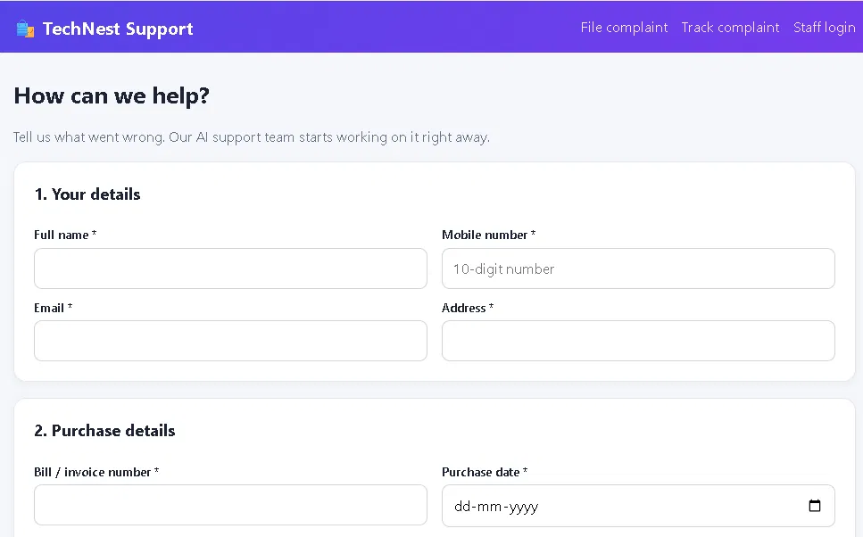
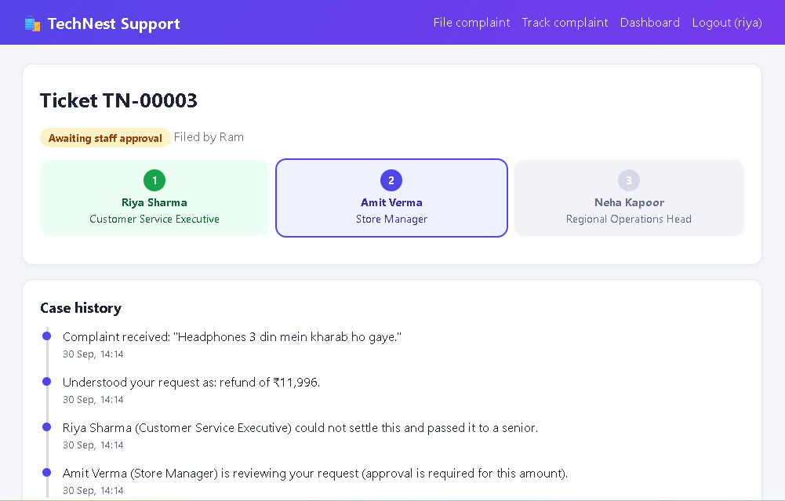
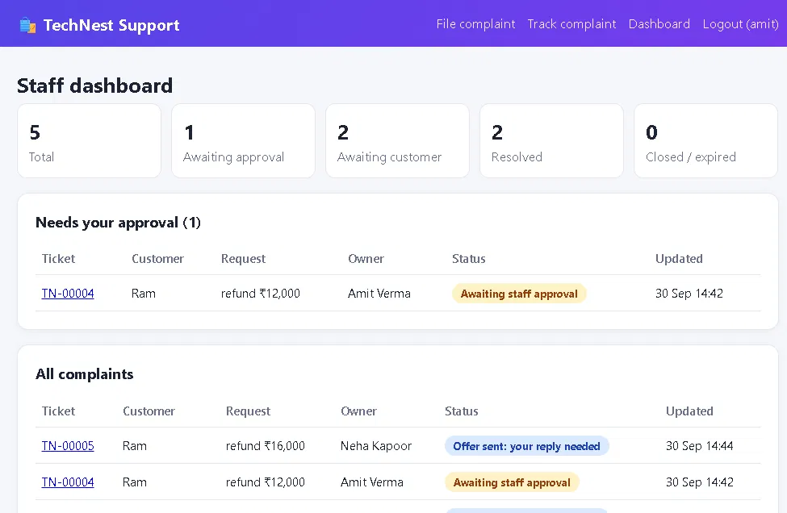
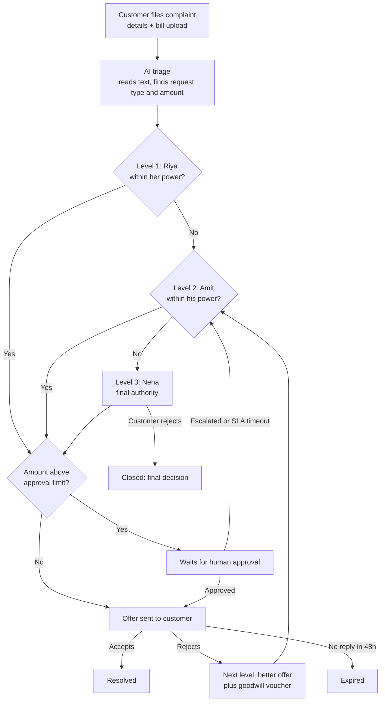

# TechNest Support: an Autonomous AI Complaint-Escalation Agent

An agentic AI system for customer support. A customer files a complaint, an AI agent reads it, decides what to offer, and **escalates it through a three-level staff hierarchy** until the customer is satisfied or the head makes the final call. The AI is free to decide, but **hard-coded guardrails** stop it from ever going beyond a person's authority.

Built with **pure Python (standard library only)**, **SQLite** and the **Google Gemini API**. It also runs fully offline with a built-in rule engine.

## Screenshots

| Complaint form | Customer tracking page | Staff dashboard |
|---|---|---|
|  |  |  |

## How it works



### The staff hierarchy

| Level | Person | Refund limit | Compensation limit | Exchange window | Human approval above |
|---|---|---|---|---|---|
| 1 | Riya Sharma, Customer Service Executive | ₹2,000 | none | 7 days | ₹1,000 |
| 2 | Amit Verma, Store Manager | ₹15,000 | ₹15,000 | 365 days | ₹10,000 |
| 3 | Neha Kapoor, Regional Operations Head | unlimited | ₹50,000 | unlimited | ₹25,000 |

## Key features

- **AI triage:** Gemini reads the complaint (English, Hindi or Hinglish) and extracts the request type and claimed amount. Keyword rules take over if the AI is unavailable.
- **Autonomous escalation loop:** the agent keeps passing the case up until someone can make an offer.
- **Human-in-the-loop:** offers above a person's approval limit wait for that staff member to approve or escalate.
- **SLA timers:** if staff do not respond within 15 minutes, the case escalates automatically. If the customer is silent for 48 hours, it expires.
- **Customer portal:** full details (name, address, mobile, email, bill number and bill upload), a secret tracking link and a live progress view.
- **Staff dashboard:** login, statistics, an approval queue and full case history.
- **Email notifications:** the customer is emailed on every status change (SMTP, or a dry-run mode that prints to the terminal).

## Guardrails and security

- **The AI proposes, code enforces.** The AI can escalate early, but it can never approve something beyond the current person's limits. Offer amounts are computed by code, never taken from AI text.
- Complaint text is treated as **data, not instructions** (prompt-injection defence).
- Refunds are capped at the purchase amount. Input is validated (Indian mobile format, email, dates).
- Uploaded bills are checked by real file signature, size-limited and stored under random names. Only logged-in staff can view them.
- Tracking links use unguessable tokens, so customers cannot see each other's cases.
- Staff sessions use HttpOnly, SameSite cookies, and repeated wrong passwords lock the login for 5 minutes.
- The API key is read from an environment variable and is never stored in code.

## Quick start

Requires Python 3.9 or newer. There is nothing to install.

```bash
python technest_agent.py
```

Open `http://localhost:8000`. Staff log in at `/login` with the users `riya`, `amit` or `neha`.

To enable the AI and set your own password (PowerShell shown; use `export` on Mac/Linux):

```powershell
$env:GEMINI_API_KEY="your-key"
$env:TECHNEST_PASSWORD="choose-a-strong-password"
python technest_agent.py
```

### Configuration

| Variable | Default | Purpose |
|---|---|---|
| `GEMINI_API_KEY` | none | Enables AI decisions (rules are used without it) |
| `GEMINI_MODEL` | `gemini-3.5-flash` | Gemini model name |
| `TECHNEST_PASSWORD` | `technest123` | Staff password (**change it**) |
| `TECHNEST_APPROVAL_SLA` | `900` | Seconds before an unanswered approval escalates |
| `TECHNEST_CUSTOMER_SLA` | `172800` | Seconds before a silent customer's case expires |
| `SMTP_HOST`, `SMTP_PORT`, `SMTP_USER`, `SMTP_PASS` | none | Send real emails |
| `TECHNEST_BASE_URL` | `http://localhost:8000` | Link used inside emails |
| `TECHNEST_DB` | `technest.db` | SQLite database file |

## Testing

```bash
python -m unittest -v
```

14 automated tests cover staff limits, keyword triage, refund caps, the escalation chain, approval permissions, the AI guardrail, SLA timers, input validation and email notifications.

## Project structure

```
technest_agent.py   # agent, database, web server and pages (single file)
test_technest.py    # automated tests
docs/               # screenshots for this README
```

## Limitations and roadmap

- Uses Python's built-in `http.server`, which is fine for a demo but not for production traffic. Next step: move to FastAPI or Flask behind HTTPS.
- Staff share one demo password and sessions live in memory. Next step: per-user hashed passwords and a persistent session store.
- Next steps: PostgreSQL, SMS or WhatsApp alerts, retrieval of shop policy documents so the AI can cite them, and analytics on resolution time.

## Author

Built by Ravindra as a learning project in agentic AI. Licensed under the MIT License.
